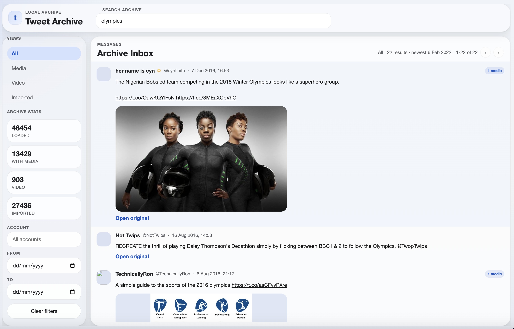

# Twitter Archive Viewer

A local-first browser for hydrated tweet JSON and curated local subsets. (A rebuild of the archive viewer in [`rehydrate-tweets`](https://github.com/lizconlan/rehydrate-tweets/tree/viewer))

## Start here

- [SPEC.md](SPEC.md): intended product shape and rebuild direction
- [viewer-behaviour.md](viewer-behaviour.md): current behaviour contract to preserve during changes

## Commands

- `make refresh-viewer-data SOURCE=/path/to/archive-or-raw_data`
- `make test-viewer`
- `make launch-archive-viewer SOURCE=/path/to/archive-or-raw_data`
- `make import-viewer-subset SOURCE=/path/to/archive-or-raw_data`

Optional import controls:

- `LIMIT=<n>` to cap the number of imported tweets
- `MODE=latest`, `MODE=oldest`, or `MODE=random`
- `REQUIRE_MEDIA=1` to keep only tweets with media
- `REQUIRE_LOCAL_MEDIA=1` to keep only tweets whose media already exists locally

## Repo map

- `index.html`: archive list UI shell
- `tweet.html`: single-tweet detail entry point
- `app.js`: client-side state, filtering, pagination, routing, and rendering
- `styles.css`: shared viewer styling
- `build_viewer_data.py`: builds browser-ready viewer data from supplied archive sources
- `import_archive_subset.py`: builds browser-ready viewer data from a curated subset selection

## Previous implementation

## License

This code is available under the [MIT License](LICENSE)
